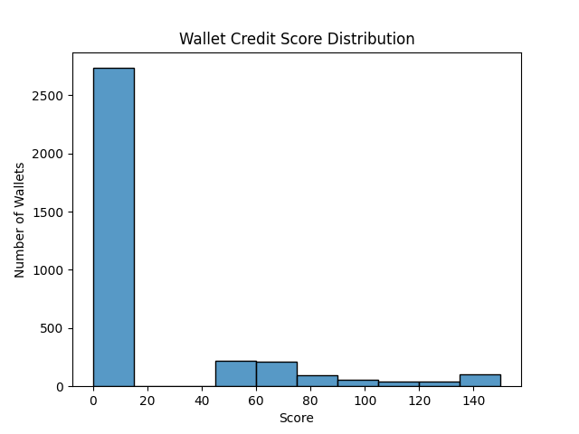

#  Credit Score Analysis

##  Score Distribution

See `score_distribution.png` for a visual.

### Score Buckets:

| Score Range | Wallet Count | Key Behavior                     |
|-------------|--------------|----------------------------------|
| 0–100       | High          | Many liquidations, no repayments |
| 100–300     | Moderate      | Poor repayment, irregular usage |
| 300–600     | Mid           | Average behavior                |
| 600–900     | Good          | Active, diverse, mostly repaid  |
| 900–1000    | Excellent     | Fully repaid, diverse assets, no liquidations |

##  Insights

- Low scorers : Frequently liquidated, low activity, poor repayment history.
- High scorers : Consistent activity, token diversity, excellent repayment ratios.

